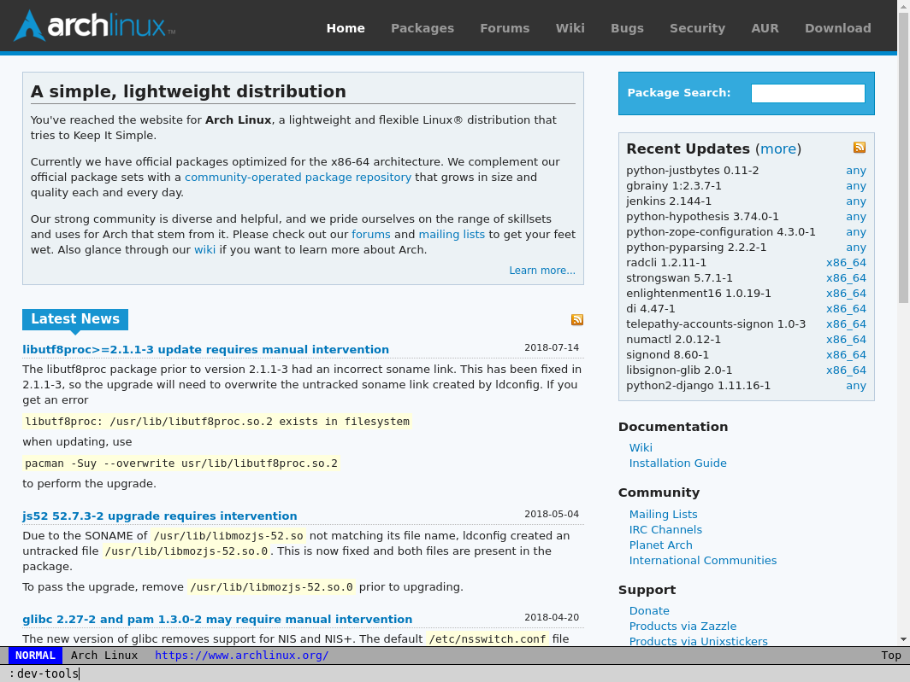

# Minichrome

Minichrome is a minimalistic web browser, built especially with tiling window
managers in mind.  It explicitly does not have a tabbed UI and avoids most UI
chrome in favor of keyboard shortcuts.



## Why Minichrome?

I used to be an avid user of browsers like [surf](https://surf.suckless.org/)
and [uzbl](https://www.uzbl.org/).  However, these browsers are built on top of
webkit, and have fallen behind modern Chrome in a few ways, most especially the
developer tooling.

Minichrome is built on [Electron](https://electronjs.org), and thus tracks
fairly close to the latest Blink rendering engine, and always has up-to-date
Chrome dev tools.

In order to stay as light as possible on resources, Minichrome is built as a
client-server architecture.  The server exposes an HTTP interface and owns all
browser windows, and the client provides a simple CLI wrapper over the HTTP
calls to create and manipulate windows.  This means you'll only have one
instance of Electron running for all your Minichrome windows, rather than one
instance of Electron per window.  It also means you can script pretty much
anything around Minichrome by using the client interface, and could even build
software that remotely interfaces with minichrome via the HTTP interface.

Note that individual frames render in their own process, so you still will have
process isolation between websites.

## Installing

There is an AUR package for arch linux users, available
[here](https://aur.archlinux.org/packages/minichrome/).

_We welcome contributions--please help us by contributing packaging
files for other distributions!_

For other users, you can download and install from the latest [release
tarball](https://github.com/cprussin/minichrome/releases).

You can also build from source:

```bash
cd <source directory>
yarn package
```

Minichrome assets will be built to the `build/minichrome-{platform}` directory.

## CLI

To run the server, simply run 

```sh
minichrome
```

To open a new window, when a minichrome server is running, run:

```sh
minichrome browse "http://xkcd.com"
```

You can run `minichrome help` for help on how you can send commands to windows.

## Keybindings

Minichrome uses vim-style keybindings:

- <kbd>h</kbd> - scroll left
- <kbd>l</kbd> - scroll right
- <kbd>j</kbd> - scroll down
- <kbd>k</kbd> - scroll up
- <kbd>C-u</kbd> - big scroll up
- <kbd>C-d</kbd> - big scroll down
- <kbd>G</kbd> - scroll to the bottom of the page
- <kbd>g g</kbd> - scroll to the top of the page
- <kbd>C-+</kbd> - zoom in
- <kbd>C--</kbd> - zoom out
- <kbd>C-0</kbd> - reset zoom
- <kbd>C-o</kbd> - go back
- <kbd>C-i</kbd> - go forward
- <kbd>C-r</kbd> - refresh page
- <kbd>C-R</kbd> - hard refresh page (refresh ignoring cache)
- <kbd>y y</kbd> - yank the current URL into the clipboard
- <kbd>Escape</kbd> - leave insert mode or clear the current search
- <kbd>:</kbd> - enter ex mode
- <kbd>/</kbd> - start a search
- <kbd>n</kbd> - go to the next search result
- <kbd>N</kbd> - go to the previous search result
- <kbd>i</kbd> - select the first insertable element and switch to insert mode

## Configuring

Coming soon!

## Status

This project is undergoing heavy development, and we welcome contributions!
Especially helpful are:

- Bug reports / bugfix PRs
- Feature requests / feature PRs
- Packaging implementations for other platforms
